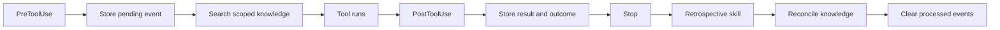

# Retrospective

Retrospective is a local-first plugin for Codex and Claude Code. It observes tool
calls, turns completed work into concise lessons, and retrieves relevant lessons
before future tool calls. Its SQLite knowledge base stays on the user's device.

## What It Does

- Records pending, completed, and failed tool events through host lifecycle
  hooks.
- Searches session, project, and global knowledge before a tool runs.
- Starts one guarded retrospective at the end of a session with completed work.
- Adds, keeps, replaces, or retires knowledge as workflows change.
- Uses SQLite FTS5 when available, with a compatible text-search fallback.
- Ignores its own MCP calls and fails open if an observational hook fails.

Retrospective stores observable tool inputs and results. It never asks for or
stores hidden chain-of-thought.

## Install

Requirements: Node.js 22.14 or newer and Git access to this repository.

### Codex

```sh
codex plugin marketplace add ketiyohannes/retrospective --ref main
```

Restart the ChatGPT desktop app, open the Plugins Directory, select the
**Retrospective** marketplace, and install **Retrospective**. Review and trust
the bundled hooks with `/hooks` before expecting automatic capture.

### Claude Code

```sh
claude plugin marketplace add ketiyohannes/retrospective
claude plugin install retrospective@retrospective
```

Run `/reload-plugins` or start a new Claude Code session after installation.
Claude Code may ask you to approve the bundled local MCP server.

See [Installation](docs/installation.md) for update, local-development, and
troubleshooting instructions.

## Workflow



The bundled MCP server exposes three tools:

- `get_retrospective_context` loads completed events and related knowledge.
- `search_knowledge` searches active session, project, and global memory.
- `apply_retrospective` applies lifecycle changes and clears processed events
  in one transaction.

## Documentation

- [Installation](docs/installation.md)
- [Architecture](docs/architecture.md)
- [Database and search](docs/database.md)
- [Hooks and lifecycle](docs/hooks.md)
- [Privacy and security](docs/privacy.md)
- [Contributing](CONTRIBUTING.md)
- [Security policy](SECURITY.md)
- [Changelog](CHANGELOG.md)

## Development

```sh
npm ci
npm run check
```

`npm run build` compiles the TypeScript, bundles standalone hook and MCP
runtimes, and regenerates `plugins/retrospective`. The generated plugin payload
is committed so GitHub marketplace installs do not need to download npm
dependencies or compile code on the user's machine.

This repository is a GitHub-hosted marketplace catalog for both Codex
(`.agents/plugins/marketplace.json`) and Claude Code
(`.claude-plugin/marketplace.json`). It is not a listing in GitHub's Apps
Marketplace.
