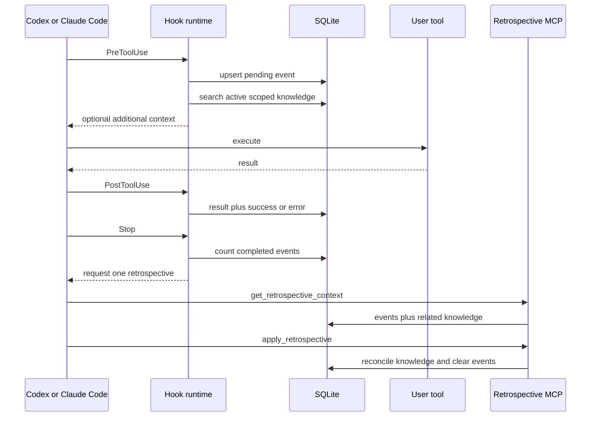

# Architecture

Retrospective has four small runtime boundaries:

1. Hooks observe tool activity and request relevant knowledge.
2. SQLite stores transient tool evidence and durable knowledge.
3. An MCP server exposes a narrow read and reconciliation API.
4. A skill tells the model how to turn evidence into durable lessons.

## Runtime Flow

## Source Layout

- `src/database`: migrations, scoped search, and lifecycle writes
- `src/hooks`: host contracts and fail-open hook entrypoints, including the
  Claude-specific failure event adapter
- `src/mcp`: stdio MCP server and tool schemas
- `src/retrospective`: transactional retrospective service
- `skills/retrospective`: model-facing reconciliation workflow
- `packaging`: host-specific manifest and MCP templates
- `plugins/retrospective`: generated, committed marketplace payload

## Packaging

`npm run build` performs four steps:

1. Remove the root `dist` directory.
2. Compile source and tests with TypeScript.
3. Bundle the MCP server and hooks with esbuild.
4. Recreate `plugins/retrospective` with both host manifests and the compiled
   runtime.

Marketplace installations copy only the plugin payload into a host cache. The
payload therefore contains everything needed at runtime and never reaches back
into the source tree.

## Failure Model

Hooks are observational and catch all runtime errors. A database or parsing
failure must not block a user's tool call. MCP operations are explicit and may
return errors because they are the authoritative read and write interface.

The `apply_retrospective` operation updates knowledge and deletes processed tool
events in one SQLite transaction. A failed lifecycle change leaves both sets of
records unchanged.
